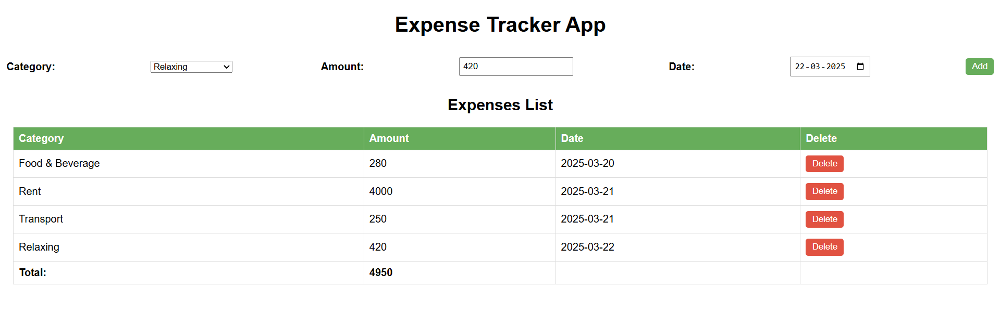

# Expense Tracker App

## Description

The **Expense Tracker App** is a simple web-based application that helps users manage their daily expenses efficiently. Users can add, view, and delete expense records categorized by type, amount, and date. The app dynamically updates the total expenses and provides an intuitive user interface.

## Features

- Add new expenses with category, amount, and date.
- View a list of all recorded expenses.
- Delete individual expenses.
- Automatically update the total expense amount.
- Simple and clean UI with interactive elements.

## Screenshot


## Technologies Used

- **HTML**: Structure of the application.
- **CSS**: Styling for a visually appealing layout.
- **JavaScript**: Handles dynamic interactions and data manipulation.

## Project Structure

```
Expense_Tracker/
├── script.js
├── style.css
└── index.html
```

## Running the Application

1. Open the `index.html` file in a web browser.
2. Start adding your expenses by selecting a category, entering an amount, and choosing a date.
3. Click the "Add" button to save the expense.