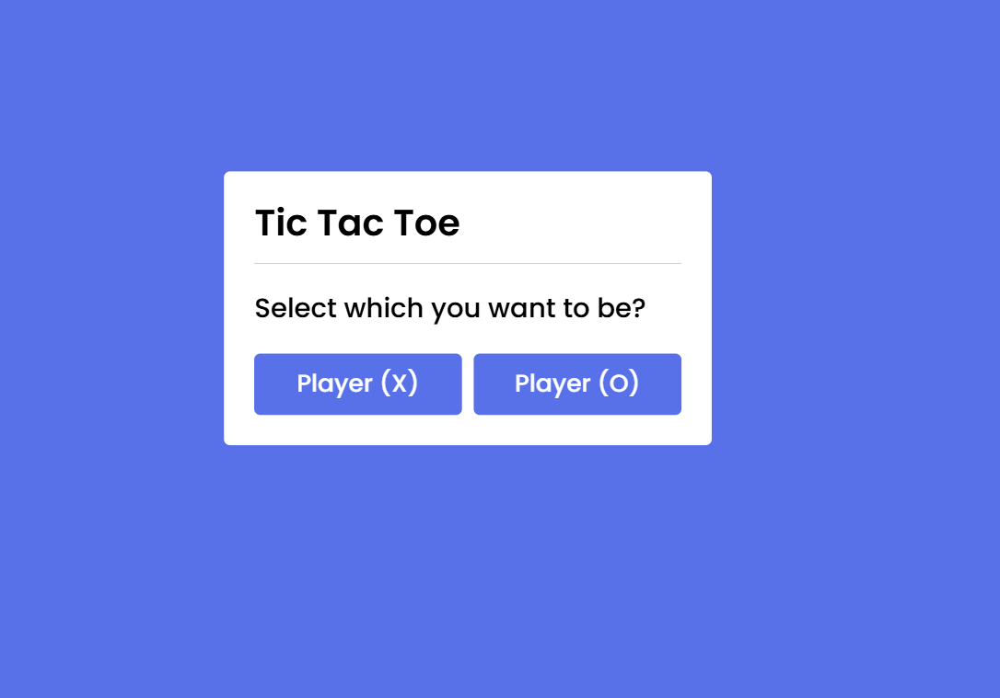
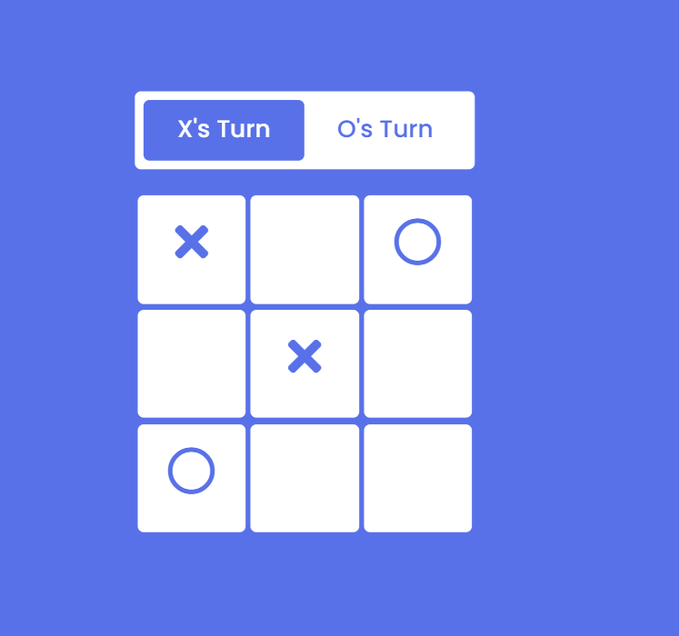
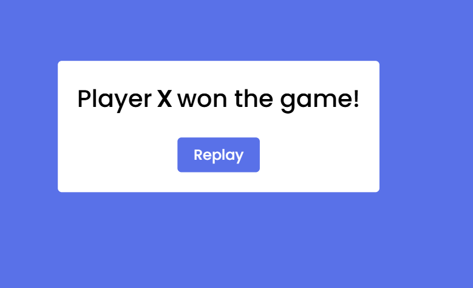

# 🎮 Tic Tac Toe Game (Player vs Bot)

A simple and responsive **Tic Tac Toe game** built using **HTML, CSS, and Vanilla JavaScript**, where a human player can play against a **random-move bot**. The bot picks any empty space on the board to make its move.

---

## 🚀 Features

- ✅ Play Tic Tac Toe (3x3 grid) against a simple bot.
- ✅ Bot makes **random moves** in available spaces.
- ✅ Choose to play as **X or O**.
- ✅ Alternating turns between player and bot.
- ✅ Game ends when:
  - A player wins (3 symbols in a row, column, or diagonal).
  - All spaces are filled (draw).
- ✅ Responsive and simple UI with hover animations.
- ✅ Restart option to play again.

## 🕹️ How to Play

- Choose whether you want to play as **X or O** when the game starts.
- Click on any **empty box** to place your symbol.
- After you make a move, the **bot will automatically play** by picking a random available box.
- The game will detect if a **player wins** or if it's a **draw**.
- You can **restart the game** to play again.

---

## ⚙️ Technologies Used

- **HTML5** — Markup Language
- **CSS3** — Styling and Animations
- **JavaScript (ES6)** — Game Logic and Interactions
- **FontAwesome** — Icons for X and O

---

## 💡 Game Logic Overview

- **Player vs Bot system**:
  - After player's move, **bot checks for empty spaces**.
  - **Bot picks a random empty box** and places its symbol.
- **Win checking** after each move (rows, columns, diagonals).
- **Turn management** and UI update based on current player.
- **Game over screen** showing winner or draw message.


---

## 🖥️ Demo

> ⚙️ **Preview Screenshot**





---

## 📂 Project Structure

```
Tic_Tac_Toe_Game/
├── index.html # Main HTML file (Game layout)
├── script.js # JavaScript file (Game logic and bot)
├── style.css # CSS file (Styling and animations)
├── README.md # Project documentation
├── image.png # Screenshot or demo image
├── image-1.png # Additional screenshot or demo image
└── image-2.png # Additional screenshot or demo image

```

---

## 🛠️ Setup

1. Clone the repository to your local machine.
2. Open the `index.html` file in your browser to start playing.
3. You can also open the `script.js` and `style.css` files to modify the game logic and styling.

---

